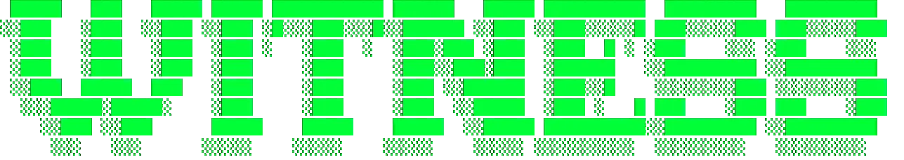

# 
<div align=center>

_A mission of [The Carpocratian Church of Commonality and Equality](https://carpocratian.org/)_</div>

<div align=center></div>

# 🙌 Witness: Post-Blockchain Timestamping

**Prove when something existed—without trusting any single party, and without the bottlenecks of a blockchain.**

Witness is a federated witness network that provides threshold-signed timestamps. It is designed to be a privacy-preserving, decentralized timestamping service that treats blockchains as optional storage, not as an execution engine.

## Blockchain, you're fired! Key Features

- **No Blockchain Bottlenecks:** Transactions are instant and free. We use blockchains only for optional, batched settlement.
- **Threshold Signatures:** Requires multiple independent witnesses to collude to forge timestamps.
- **BLS Signature Aggregation:** Optional BLS12-381 signatures provide 50% bandwidth savings.
- **Federated Architecture:** Multiple independent networks can cross-anchor for additional security.
- **Privacy-Preserving:** Only hashes are submitted, not content.
- **Simple Integration:** Easy-to-use CLI and REST API.

## CAN I GET A

Witness has three operating modes:

1. **Phase 1 - Minimal (single network):** One set of witnesses with threshold signatures. Good for development and low-stakes use.

2. **Phase 2 - Federated (cross-network anchoring):** Multiple independent Witness networks periodically witness each other's merkle roots. Enhanced security through federation.

3. **Phase 3 - Hardened (external anchors):** ✅ **Now Available!** Batch merkle roots are automatically anchored to immutable public services. This effectively creates an "Optimistic Rollup" for truth—you get the speed of a web API with the finality of Ethereum.

## 🐳 Docker Quickstart

Start the entire network (Gateway + 3 Witnesses) with one command. No Rust installation required.

```bash
# 1. Start the network
docker compose up --build

# 2. Timestamp a file (using the CLI inside the container)
# We use the gateway container to run the CLI tool against itself
docker compose exec gateway witness-cli --gateway http://localhost:8080 timestamp --hash $(echo -n "hello" | sha256sum | awk '{print $1}')
```

## Core Design Goals

### 1. Privacy & Sovereignty
Identity is ephemeral. State is fluid. Witness provides the temporal context without requiring user accounts, tracking, or public transaction graphs.

### 2. Environmental Conservation 🌿
Witness is designed to be **metabolized, not mined**.
- **No Mining:** We replace Proof-of-Work with lightweight threshold signatures. A Witness node can run on a Raspberry Pi.
- **No Zombie Servers:** The architecture is efficient and event-driven.
- **Lazy Demurrage:** By relying on bounded validity windows (in connected protocols like [Scarcity](https://github.com/flammafex/scarcity)), we prevent state bloat and infinite storage requirements.
- **Ethical Anchoring:** When we do use a blockchain (Phase 3), we use **Proof-of-Stake Ethereum**, ensuring our carbon footprint remains negligible.

## Architecture

```
Client → Gateway → Witnesses (threshold sign) → Signed Attestation
```

### Components

- **witness-core:** Shared types, crypto primitives (Ed25519 + BLS12-381), verification logic
- **witness-node:** Individual witness node that signs attestations
- **witness-gateway:** Aggregates requests, fans out to witnesses, collects/aggregates signatures
- **witness-cli:** Command-line tool for timestamping files
- **Admin Dashboard:** Optional web UI for monitoring (`--admin-ui` flag)

## Quick Start

### Prerequisites

- Rust 1.70+ (`cargo --version`)
- SQLite

### Setup

1. Clone the repository:
```bash
git clone [https://github.com/your-org/witness](https://github.com/your-org/witness)
cd witness
```

2. Run the setup script to generate keys and configs:
```bash
./examples/setup.sh
```

3. Start the network:
```bash
./examples/start.sh
```

### Try It Out

Timestamp a file:
```bash
cargo run -p witness-cli -- timestamp --file README.md --save attestation.json
```

## ☁️ Production Deployment

Deploy a censorship-resistant multi-gateway network for **under $20/month**.

### Multi-Gateway Quorum

For production use with [Scarcity](https://github.com/flammafex/scarcity), deploy **3 independent Witness networks** across different datacenters. Clients query all gateways and require 2-of-3 agreement—no single gateway can censor or forge timestamps.

```
┌─────────────┐  ┌─────────────┐  ┌─────────────┐
│  Gateway A  │  │  Gateway B  │  │  Gateway C  │
│  Frankfurt  │  │  Nuremberg  │  │  Helsinki   │
│ 3 witnesses │  │ 3 witnesses │  │ 3 witnesses │
└─────────────┘  └─────────────┘  └─────────────┘
       │                │                │
       └────────────────┼────────────────┘
                        ▼
              Client queries all 3
              Requires 2-of-3 agreement
```

### Recommended Setup (Hetzner Cloud)

| Server | Location | Role | Spec | Cost |
|--------|----------|------|------|------|
| VPS 1 | FSN1 (DE) | Gateway A + Witness B3 + Witness C2 | CX22 | ~€6/mo |
| VPS 2 | NBG1 (DE) | Gateway B + Witness C3 + Witness A2 | CX22 | ~€6/mo |
| VPS 3 | HEL1 (FI) | Gateway C + Witness A3 + Witness B2 | CX22 | ~€6/mo |

**Total: ~€18/month** for a fault-tolerant, geographically distributed network.

Each datacenter hosts witnesses from *all* networks—no single datacenter failure takes down any network.

## Advanced Configuration

### External Anchoring (Phase 3)

For maximum security and public verifiability, enable **external anchoring** to submit batch merkle roots to public services.

**The "Post-Blockchain" Model:**
We use Ethereum (and other EVM chains) as they were intended: as a final settlement layer for truth, not a slow database for buying coffee. Users enjoy instant, free, private transactions. The Network pays the gas to anchor the history once per batch period.

**Supported Providers:**
- ✅ **Internet Archive** - Free, public, permanent web archive
- ✅ **Trillian/Tessera** - Cryptographic transparency logs
- ✅ **DNS TXT Records** - Distributed verification via DNS
- ✅ **Blockchain (Ethereum/EVM)** - Immutable hard finality

#### Configuration

Add to your `network.json`:

```json
{
  "external_anchors": {
    "enabled": true,
    "anchor_period": 3600,
    "minimum_required": 2,
    "providers": [
      {
        "type": "internet_archive",
        "enabled": true,
        "priority": 1
      },
      {
        "type": "trillian",
        "enabled": true,
        "priority": 2,
        "log_url": "[https://your-trillian-log.example.com](https://your-trillian-log.example.com)"
      },
      {
        "type": "blockchain",
        "enabled": true,
        "priority": 4,
        "rpc_url": "[https://mainnet.infura.io/v3/YOUR_KEY](https://mainnet.infura.io/v3/YOUR_KEY)",
        "private_key": "YOUR_GATEWAY_WALLET_PRIVATE_KEY",
        "chain_id": 1
      }
    ]
  }
}
```

## FAQ

**Q: What does "Post-Blockchain" mean?**
A: It means goodbye to the **bottlenecks** of blockchains. We don't use the blockchain to process transactions (that's slow and expensive). We use it to bury the receipt (that's secure). We moved the blockchain to the basement where it belongs.

**Q: Is this system really "Zero-Cost"?**
A: For the user, yes. There are no gas fees. For the Gateway operator, enabling Phase 3 Ethereum anchors incurs gas costs. This is an optional feature for networks that require hard finality.

**Q: Can witnesses see my data?**
A: No, you only submit SHA-256 hashes, not the content itself.

## License

Apache 2.0 - see LICENSE file for details.